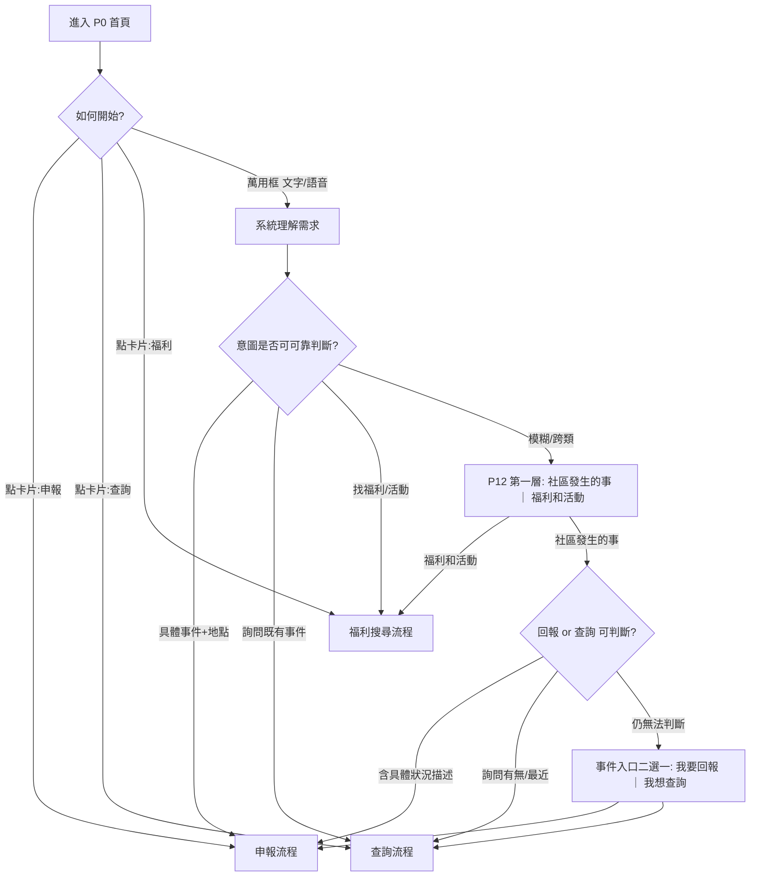
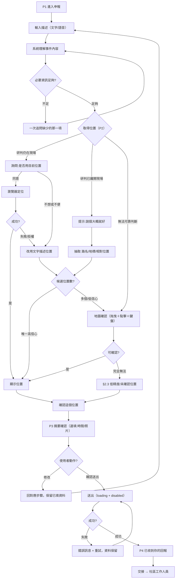
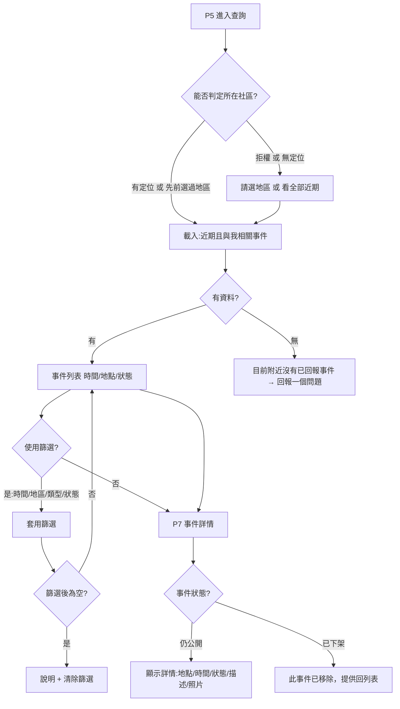
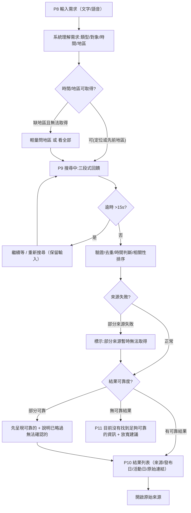

# Session 6：使用者流程設計（User Flow Design）

> 本文件將 `Session1_產品目標與範圍.md`、`Session2_使用情境與互動需求.md`、`Session3_介面規劃.md`、`Session4_UX規劃.md`、`Session5_設計方向_Firefox風格.md` 已定的規劃，收斂成**三項核心功能在使用者可見行為層的完整端到端流程**，含決策點與例外分支。
>
> 適用範圍：里民端（公開 Web 平台）的流程行為；**不涉及** Agent／Tool／API／Database 等內部實作（對應 S2 §24）。
>
> 產出時機：本文件為實作前的流程基準；經確認後才進入 `writing-plans` 產出實作計畫。

---

## 0. 設計 brief（對齊結論）

**意圖**：把 S1–S5 的規劃收斂成三功能在使用者可見行為層的完整端到端 flow（含決策點與例外分支），作為後續實作依據。

**範圍與限制**

| 項目 | 決策 |
|---|---|
| 抽象層級 | 使用者可見行為層（不出現 Agent／Tool／API／Database） |
| 對象 | 只做**里民端**；流程標出「交接給工作人員」的交接點 |
| 身分 | **純匿名**（無登入步驟） |
| 入口 | 三張大卡片 ＋ 首頁萬用輸入框，定義**意圖分流** |
| 沿用 | P0–P12 畫面編號（S3）、狀態設計（S4 §4）、文案（S4 §6）、tokens（S5） |
| 原則 | 高齡友善、一次一問、不幻覺、例外一定有出路（S4 UX-1～UX-6） |

**成功標準**

- 實作者能照著 flow 直接做，不需回頭猜。
- 每個決策點與例外都有明確出路，沒有斷點。
- S2 §14.4「完全無法確認位置」在此定案。
- 可作為 `writing-plans` 的輸入。

**符號約定**：`P#` 為 S3 畫面編號；`[ ]` 為使用者可見的重點行為／文案；流程圖為 Mermaid。

---

## 1. 頂層入口與意圖分流（P0 → 三流程 / P12）

### 1.1 分流規則

| 輸入／操作 | 判斷 | 去向 |
|---|---|---|
| 點「申報社區事件」卡片 | 明確 | 申報流程 |
| 點「查詢目前事件」卡片 | 明確 | 查詢流程 |
| 點「搜尋福利與活動」卡片 | 明確 | 福利搜尋流程 |
| 萬用框：含**具體事件＋地點描述**（「中華路有路燈壞掉」） | 事件·回報 | 申報流程（帶入描述） |
| 萬用框：**詢問既有事件**（「附近有沒有積水」） | 事件·查詢 | 查詢流程 |
| 萬用框：**找福利／活動**（「這個月老人活動」） | 福利／活動 | 福利搜尋流程 |
| 萬用框：**無法判斷或跨類**（「最近有什麼？」） | 模糊 | P12 第一層：`社區發生的事` ｜ `福利和活動` |

### 1.2 事件內部的次級分流

S2 §21／P12 僅設計「事件 vs 福利」兩選一。使用者選「社區發生的事」後仍分**回報**與**查詢**：

1. **優先自動判斷**：描述含具體狀況 → 視為回報；詢問「有沒有／最近」→ 視為查詢。
2. **只在無法判斷時**，才於事件入口再問一次二選一（`我要回報` ｜ `我想查詢`）。
3. 維持「只問真正必要的」（S4 §2.4）。

### 1.3 流程圖

---

## 2. 申報社區事件主流程（P1 → P4）

### 2.1 流程圖

### 2.2 決策／例外對照

| 節點 | 情境 | 行為 |
|---|---|---|
| Q1／Q2 | 描述缺事件／時間等 | **一次只問一項**，不列整張表單 |
| LA／LC | 在現場＋拒權／定位失敗 | 立即改文字描述；**不阻擋** |
| LB3／CAND | 已離開、多候選 | 進地圖確認；地圖非唯一操作（可鍵盤／點擊） |
| MAP | 無法判斷 | 地圖自行確認 |
| EX | 完全無法確認位置 | **三層降級，絕不生成假座標**（見 §2.3） |
| EDIT | 摘要頁要改 | 回對應步驟且**保留資料**（UX-6） |
| SUB／OK | 送出失敗／重複點 | loading+disabled、失敗可重試 |

### 2.3 §14.4 定案：完全無法確認位置

1. **首選**：在 P2 地圖上點出「**大概範圍**」→ 位置標為「低精度（大概區域）」。
2. **次選**：使用者不願或無法操作地圖 → 可選「**不確定，先送出**」→ 事件仍建立，位置欄顯示「**位置未確認**」並保留使用者原話；事件卡明顯標示「位置待確認」，提示工作人員。
3. **絕不**生成假座標；**絕不**假裝精確。
4. **不做**「由本人稍後補充」的回填機制（純匿名、無帳號）；改由事件卡提示工作人員處理。

### 2.4 關鍵規則

- 一次只問一個缺少欄位（降低壓迫感）。
- 位置永遠提供「用文字描述」的替代路徑，不強迫開地圖或定位。
- 送出不可重複觸發（loading + disabled）。
- 成功必給明確確認（P4）。

---

## 3. 查詢目前事件主流程（P5 → P7）

### 3.1 流程圖

### 3.2 關鍵規則

| 項目 | 設計 |
|---|---|
| 預設結果 | **近期且與我相關**，非全部歷史（S1 §3.2.2） |
| 「與我相關」判定（匿名） | 首次以定位推得所在里／區；拒權則請使用者選地區或看全部；**記住選擇**（localStorage），下次免再問 |
| 篩選 | 用 chips（時間／地區／類型／狀態），不用下拉多層；為空時提供「清除篩選」（S4 §2.2） |
| 空狀態 | 「目前附近沒有已回報的事件」＋[回報一個問題]（給下一步，UX-4） |
| 詳情 | 顯示地點／時間／狀態／描述／照片；**不顯示申報者個資**（純匿名） |
| 已下架 | 明確說明並回列表，不顯示空白 |
| 內部 | 純 Database 查詢、不經 Agent（S2 §16）；使用者可見層**看不出差別**，故 flow 不加內部方塊 |

**狀態欄位說明**：P7 的「狀態」（待處理／處理中／完成）由工作人員端維護，本文件不設計工作人員端；此處將狀態視為**已存在的資料**顯示。若事件尚未被工作人員更新，顯示預設狀態（如「已回報」）。

---

## 4. 搜尋福利與活動主流程（P8 → P11）

### 4.1 流程圖

### 4.2 關鍵規則

| 項目 | 設計 |
|---|---|
| 等待體驗 | 三段式：`正在理解你的問題…` → `正在搜尋政府與社區資訊…` → `正在整理結果…`；>15s 給「繼續等／重新搜尋」；**保留輸入**（S4 §5） |
| 地區取得 | 定位或先前選擇；缺且取不到才輕量問，否則用「全部近期」 |
| 去重／時效 | 去除重複、判斷活動是否過期、依時間／地區／相關性／可信度排序（S2 §19） |
| 來源失敗 | 不靜默失敗；標示部分來源無法取得，仍呈現已取得的 |
| 低信心 | **不呈現**，不為湊數列出（S2 §22、UX-5） |
| 每筆結果 | 必附**來源單位 · 發布日期 · 活動／有效日期 · 原始連結**（S2 §20） |
| AI 揭露 | 顯示「以下內容由系統整理，請以原始來源為準」（S4 §7） |
| 無可靠結果 | 明確告知＋建議放寬條件＋[重新搜尋]（P11） |

**釐清歸屬**：S2 §21／P12 的「二選一釐清」已歸在 §1 頂層分流；本流程**不重複問**，僅在福利需求「缺地區」時做一次輕量詢問，其餘用預設值。

---

## 5. 跨流程例外與狀態對照

### 5.1 共通例外（三流程共用）

| 例外 | 一致行為 |
|---|---|
| 網路／服務失敗 | 明說原因＋[重試]；**不靜默失敗**；保留已填資料 |
| 定位權限被拒／失敗 | 立刻提供**文字描述**替代路徑，不阻擋 |
| 麥克風不可用／被拒 | 文字輸入**完整可用**；不以此為唯一輸入 |
| 送出重複點擊 | 按鈕 loading＋disabled |
| 無結果／空狀態 | 一定給**下一步**（回報／放寬／清除篩選） |
| 系統無法可靠判斷 | **問使用者**，絕不生成看似精確的事實／座標 |
| 已下架／失效內容 | 明確說明＋回上層，不留白 |

### 5.2 狀態對照（對齊 S4 §4）

| 畫面 | Default | Loading | Empty | Error | Partial |
|---|---|---|---|---|---|
| P0 首頁／分流 | ✓ | – | – | – | – |
| P1 描述事件 | ✓ | 理解中 | 內容不足（一次一問） | 失敗重試 | – |
| P2 確認位置 | ✓ | 定位中 | 無候選 | 失敗／拒權 | 多候選→地圖 |
| P3 摘要確認 | ✓ | 送出中 | – | 送出失敗 | – |
| P4 完成 | ✓(成功) | – | – | – | – |
| P5 查詢事件 | ✓ | 載入中 | 無近期事件 | 查詢失敗 | – |
| P7 事件詳情 | ✓ | – | – | 已下架 | – |
| P8 輸入需求 | ✓ | – | – | – | – |
| P9 搜尋中 | – | ✓ | – | 逾時 | 部分來源失敗 |
| P10 結果 | ✓ | – | – | – | 部分結果 |
| P11 無可靠結果 | – | – | ✓ | – | – |
| P12 釐清 | ✓ | – | – | – | – |

### 5.3 本次 flow 一併定案的待決事項

1. ✅ S2 §14.4 完全無法確認位置 → 低精度／未確認位置，不生成假座標、不做回填（§2.3）。
2. ✅ 登入／匿名 → 純匿名，無登入步驟。
3. ✅ 首頁萬用輸入框 → 保留，並定義 §1 意圖分流。
4. ⏳ **尚未定**：每頁結果數量／「查看更多」是分頁或載入更多（不影響 flow 結構，留待介面細節）。

---

## 附錄 A：與其他文件的對應

| 本文件 | 來源 |
|---|---|
| §1 分流 | S2 §9、§10、§21；S3 P0／P12 |
| §2 申報 | S2 §11–§14；S3 P1–P4；S4 §2.1 |
| §3 查詢 | S2 §15–§16；S3 P5–P7；S4 §2.2 |
| §4 福利搜尋 | S2 §17–§22；S3 P8–P11；S4 §2.3、§5 |
| §5 例外／狀態 | S4 §3、§4；S2 §22 |
| 視覺 | S5（tokens）；S3 §6（tokens） |

## 附錄 B：後續（非本文件範圍）

- 工作人員端（進件、狀態流轉、回覆里民）——本次僅標交接點。
- 每頁結果數量與「查看更多」行為。
- Software Architecture：Agent 數量／框架／分工、前端技術棧（S1、S2、S3 皆延後）。
- 登入以外的法遵細節（位置與錄音保存，S4 §8）。
